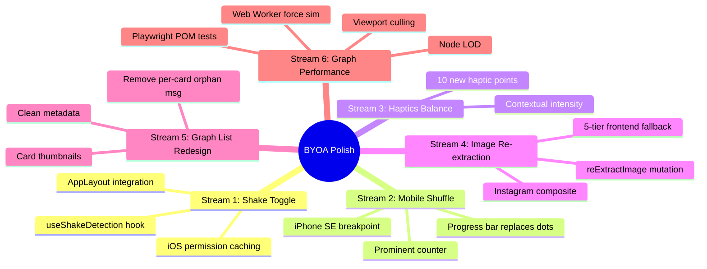

# Shake Toggle, Haptics, Graph Performance & Image Re-extraction

**Date:** 2026-04-05
**Status:** Approved
**Streams:** 6 independent implementation streams

---

## Context

BYOA is a visual research platform (Redwood.js + React 18 + Supabase). The app has a ShuffleModal for random card discovery, a force-directed graph view (react-force-graph-2d / Canvas 2D), and an enrichment pipeline for ingesting content from Instagram, websites, etc.

Current problems:
- Shake gesture only closes ShuffleModal (can't open it from anywhere)
- Haptic feedback is sparse — only on a few nav elements
- ShuffleModal dot indicators break on iPhone SE (375px) with >8 cards
- Cards frequently show empty/broken images (especially Instagram posts)
- Graph List view shows generic icons instead of card thumbnails, with verbose per-card orphan messages
- Graph canvas rendering uses Canvas 2D — no GPU acceleration for large graphs



---

## Stream 1: Global Shake to Shuffle Toggle

### Design

Extract shake detection from `ShuffleModal` into a reusable `useShakeDetection(onShake)` hook. Wire into `AppLayout` where `showShuffle` state already lives.

### Hook: `web/src/hooks/useShakeDetection.ts`

```typescript
interface ShakeOptions {
  threshold?: number    // acceleration force threshold (default: 25)
  shakeCount?: number   // required shakes to trigger (default: 3)
  timeWindow?: number   // ms between shakes (default: 500)
}

function useShakeDetection(
  onShake: () => void,
  options?: ShakeOptions
): void
```

**Behavior:**
- Listens to `DeviceMotionEvent.accelerationIncludingGravity`
- Requires 3 consecutive high-force events within 500ms
- iOS permission via `DeviceMotionEvent.requestPermission()` — requested once, cached in `localStorage('byoa-shake-permission')`
- Desktop: hook is a no-op (no accelerometer)

**AppLayout integration:**
- `useShakeDetection(() => { haptic('heavy'); setShowShuffle(prev => !prev) })`
- Remove shake detection from `ShuffleModal` (prevent double-handling)

### Files Changed
- `web/src/hooks/useShakeDetection.ts` — NEW
- `web/src/layouts/AppLayout/AppLayout.tsx` — add hook
- `web/src/components/ShuffleModal/ShuffleModal.tsx` — remove shake logic (lines 58-91)

---

## Stream 2: Shuffle Modal Mobile Responsive

### Design

Target breakpoint: iPhone SE at 375px width. All elements must be usable and well-spaced.

### Changes

1. **Counter area:** Promote `1 / 5` from `text-xs px-2 py-0.5` pill → `text-base font-semibold tabular-nums` with proper spacing. Centered in the header between title and close button.

2. **Replace dot indicators with progress bar:**
   - Thin (3px height) accent-colored bar spanning the full footer width
   - Fill width = `(index + 1) / cards.length * 100%`
   - Smooth CSS transition on width changes
   - Tappable: click/tap X position maps to card index via `Math.floor((clientX - barLeft) / barWidth * cards.length)`

3. **Quick-pick buttons:** Add `flex-wrap gap-2` so they wrap on 375px (5 buttons at ~50px each = 250px, fits single row on 375px with padding, but wraps gracefully if padding changes).

4. **Nav footer at <400px:**
   - Prev/Next buttons become icon-only (drop text labels)
   - Touch targets remain 44px minimum
   - Counter moves to center of footer (between prev/next)

5. **Modal insets on small screens:**
   - `@media (max-width: 400px)`: `inset-x-2 inset-y-3` for more content area
   - Header padding: `px-3.5` instead of `px-5`

6. **Card content area:** Ensure image `maxHeight` scales: 260px on desktop → 200px on <400px

### Files Changed
- `web/src/components/ShuffleModal/ShuffleModal.tsx` — footer, counter, responsive classes

---

## Stream 3: Haptics Balance

### Design

Add contextual haptic feedback to 10 interaction points. Follow the web-haptics intensity hierarchy:

- `light` — navigation, passive selections
- `selection` — toggle/choice changes
- `medium` — action confirmations
- `heavy` — physical gesture responses (shake)

### New Haptic Points

| Location | File | Interaction | Style |
|---|---|---|---|
| ShuffleModal | ShuffleModal.tsx | Card swipe left/right | `light` |
| ShuffleModal | ShuffleModal.tsx | Slider value change (debounced) | `selection` |
| ShuffleModal | ShuffleModal.tsx | Quick-pick button tap | `selection` |
| ShuffleModal | ShuffleModal.tsx | Draw cards button | `medium` |
| ShuffleModal | ShuffleModal.tsx | Reshuffle button | `medium` |
| ShuffleModal | ShuffleModal.tsx | Progress bar tap (jump to card) | `light` |
| GraphClient | GraphClient.tsx | Node single-tap (focus) | `light` |
| GraphClient | GraphClient.tsx | Node double-tap (open detail) | `medium` |
| ViewModeToggle | ViewModeToggle.tsx | Already has `selection` | no change |
| AppLayout | AppLayout.tsx | Shake toggle | `heavy` (existing) |

### Debouncing
- Slider: fire `haptic('selection')` at most every 80ms during drag (not every pixel)

### Files Changed
- `web/src/components/ShuffleModal/ShuffleModal.tsx` — 6 new haptic calls
- `web/src/components/GraphClient/GraphClient.tsx` — 2 new haptic calls

---

## Stream 4: Image Re-extraction — No Empty Cards

### Design

**Goal:** No card should ever display a gradient placeholder when an image could be recovered.

### Frontend: Expanded Fallback Chain (Card.tsx)

```
Tier 1: card.imageUrl (primary, possibly Supabase Storage URL)
Tier 2: card.metadata.images[0] (carousel first image)
Tier 3: card.metadata.originalCdnUrls[0] (original CDN before persistence)
Tier 4: card.metadata.scrapedImageUrl (original scrape result)
Tier 5: Microlink screenshot (getFallbackScreenshotUrl for any URL card)
Tier 6: Gradient placeholder + silent reExtractImage mutation trigger
```

Each tier has an `onError` handler that advances to the next. Tier 5 applies to all card types with a URL (not just non-social — we now include social posts since CDN URLs expire).

**Auto re-extract trigger:**
- When a card reaches Tier 6 (gradient), silently call `reExtractImage` mutation
- Debounced: max 1 per card per browser session (`sessionStorage` set)
- On success: card updates via Apollo cache, image appears without reload

### Backend: `reExtractImage` Mutation

```graphql
mutation ReExtractImage($cardId: String!) {
  reExtractImage(cardId: $cardId) {
    id
    imageUrl
    metadata
  }
}
```

**Logic:**
1. Fetch card from DB
2. If Instagram: re-run 4-tier extraction (InstaFix → GraphQL → Embed → OG)
3. If website: retry Microlink screenshot with fresh parameters
4. If carousel with `metadata.images` having 2+ valid URLs but primary broken:
   - Fetch available images via Sharp
   - Compose 2x2 grid (or 1x2 for 2 images, or single for 1)
   - Upload composite to Supabase Storage
   - Set as new `imageUrl`
5. Rate limit: skip if card was re-extracted within last 24h (`metadata.lastReExtractAt`)
6. Update card `imageUrl` + `metadata` on success

### Instagram Composite Generation

```
2 images  → 1x2 horizontal strip (each 300x300)
3 images  → 2x2 grid with 4th slot = Instagram gradient
4+ images → 2x2 grid from first 4
```

Output: 600x600 JPEG via Sharp, uploaded to Supabase Storage at `cards/{cardId}/composite.jpg`.

### Files Changed
- `web/src/components/Card/Card.tsx` — expanded fallback chain, auto re-extract trigger
- `web/src/components/cards/InstagramCard.tsx` — same expanded chain
- `api/src/graphql/cards.sdl.ts` — add `reExtractImage` mutation
- `api/src/services/cards/cards.ts` — implement `reExtractImage`
- `api/src/lib/scraper/compositeImage.ts` — NEW: Sharp composite generation

---

## Stream 5: Graph List View Redesign

### Design

**Current problems (from screenshot):**
- Generic Network icon for every card — no images
- "SOCIAL · 0 connections" badge on every card — redundant
- Per-card "No shared-tag edges yet..." verbose message — noisy

### Changes

1. **Pass `imageUrl` to GraphListView:**
   - `GraphListNode` interface adds `imageUrl?: string | null`
   - GraphCell/GraphClient pass it through

2. **Card thumbnail (48x48):** Replace the generic icon circle with:
   - If `imageUrl`: `` with `rounded-xl object-cover` and gradient fallback on error
   - If no image: colored circle with type initial (like the graph canvas nodes)

3. **Remove per-card orphan message:** Replace with a single top-level banner (shown once, dismissable):
   > "Most cards don't have shared-tag connections yet. They'll appear as tagging improves."

4. **Clean up card metadata:**
   - Type badge: only show if there's variety in types (not all "SOCIAL")
   - Connection count: only show if > 0
   - For orphan cards: just show title + tags + thumbnail — no badges

5. **Sort order:** Connected cards first (sorted by connection count desc), then orphans (sorted alphabetically)

6. **Mobile layout:** Single column on `<640px`, two columns on `640px+`

### Files Changed
- `web/src/components/GraphListView/GraphListView.tsx` — full redesign
- `web/src/components/GraphClient/GraphClient.tsx` — pass imageUrl in node data
- `web/src/lib/graph.ts` — include imageUrl in GraphNode type

---

## Stream 6: Graph & Spaces Performance

### Immediate Optimizations (no library changes)

1. **Web Worker for force simulation:**
   - New `web/src/lib/graph-worker.ts`
   - Receives nodes + links, runs D3 force ticks, posts back positions
   - Main thread only handles rendering (Canvas draw calls)
   - Eliminates jank during simulation warmup

2. **Viewport culling:**
   - In `nodeCanvasObject`: skip draw if node `(x, y)` is outside visible canvas bounds (with padding)
   - In `linkCanvasObject`: skip if both endpoints outside bounds
   - Reduces draw calls by 60-80% when zoomed in

3. **Node LOD (Level of Detail):**
   - Zoom < 0.5: render nodes as simple filled circles (no initials, no labels)
   - Zoom 0.5-1.0: render initials, skip labels
   - Zoom > 1.0: full rendering (initials + labels)
   - Reduces per-node canvas operations at overview zoom levels

4. **requestAnimationFrame batching:**
   - Batch tooltip position updates and hover state changes
   - Prevent layout thrashing from frequent mouse events

### Testing: Playwright Page Object Model

```
tests/
  graph/
    graph.page.ts        — GraphPage POM (loadGraph, clickNode, toggleView, measureFPS)
    graph.perf.spec.ts   — Performance benchmarks
    graph.interaction.spec.ts — Interaction tests
```

**Performance targets:**
- Time to interactive: <2s for 500 nodes
- FPS during simulation: 60fps for <500 nodes, 30fps+ for 500-2000
- FPS during interaction (hover/click): 60fps at any scale

**Benchmark methodology:**
- Use `performance.now()` + `requestAnimationFrame` counting for FPS
- Use Playwright's `page.evaluate()` to inject FPS counter
- Run against fixture data sets: 100, 500, 1000, 2000 nodes

### Files Changed
- `web/src/lib/graph-worker.ts` — NEW: Web Worker for force simulation
- `web/src/components/GraphClient/GraphClient.tsx` — viewport culling, LOD, worker integration
- `tests/graph/graph.page.ts` — NEW: Playwright POM
- `tests/graph/graph.perf.spec.ts` — NEW: performance benchmarks
- `tests/graph/graph.interaction.spec.ts` — NEW: interaction tests

---

## Acceptance Criteria

### Stream 1
- [ ] Shake from home feed opens ShuffleModal with heavy haptic
- [ ] Shake while ShuffleModal open closes it with heavy haptic
- [ ] iOS permission requested once, cached
- [ ] No double-handling (ShuffleModal doesn't have its own shake listener)

### Stream 2
- [ ] Counter "1 / 5" is prominent and readable on 375px
- [ ] Progress bar replaces dots, is tappable
- [ ] All touch targets >= 44px on mobile
- [ ] Quick-pick buttons don't overflow on 375px
- [ ] Modal is usable on iPhone SE (375x667)

### Stream 3
- [ ] All 10 haptic points fire correctly on iOS Safari
- [ ] Slider haptic is debounced (no buzzing)
- [ ] Haptic intensity matches interaction weight

### Stream 4
- [ ] No card shows gradient placeholder if any image source is recoverable
- [ ] Instagram carousels with broken primary show composite
- [ ] Re-extraction fires silently, max once per card per session
- [ ] Re-extracted image appears without page reload

### Stream 5
- [ ] Graph List view shows card thumbnails (48x48)
- [ ] No per-card orphan message
- [ ] Single top banner for orphan explanation
- [ ] Connected cards sorted above orphans
- [ ] Single column on mobile

### Stream 6
- [ ] Force simulation runs in Web Worker (no main thread jank)
- [ ] Viewport culling skips off-screen nodes
- [ ] LOD reduces rendering at low zoom
- [ ] Playwright tests pass with FPS targets
