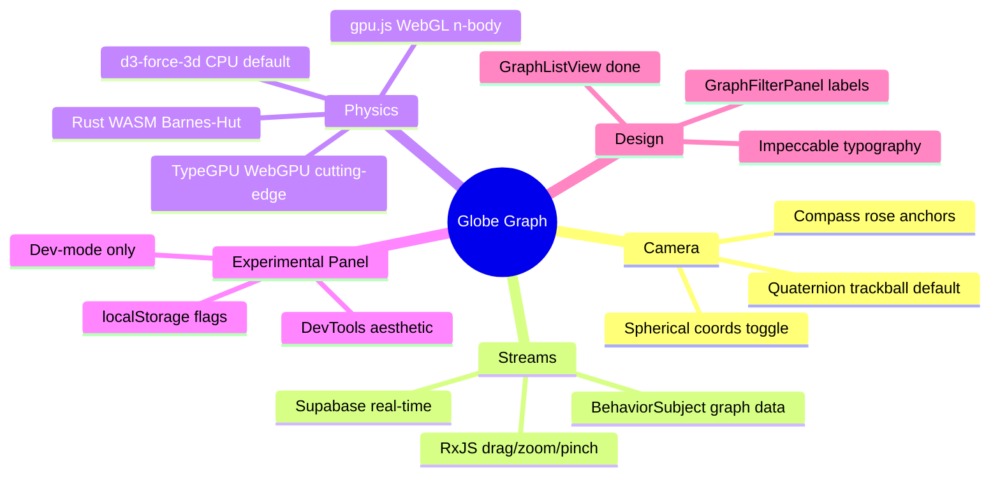

# Globe 3D Graph + Real-Time Reactive Streams

**Date:** 2026-04-14  
**Status:** Approved — ready for implementation planning  
**Scope:** ThreeGraphRenderer, RxJS stream layer, Experimental Panel, GraphListView (done), GraphFilterPanel

---

## Context

The existing `ThreeGraphRenderer` (687 LOC, Three.js + d3-force-3d + GLSL) supports a single-axis tilt — a handle that moves the camera from flat-2D to ~45° perspective. The user wants full spherical orbit (drag anywhere to rotate on all axes), real-time data sync, and a DevTools-style experimental panel to toggle between camera and physics engine strategies at runtime.



---

## Design Decisions

### D1 — Camera: Quaternion Trackball as Default

**Provenance:** Ken Shoemake, "Arcball Rotation Control," *Graphics Gems IV* (1992), pp. 175–192. The same technique used in Blender's viewport and Cinema 4D's trackball.

A single `THREE.Quaternion` represents the full camera orientation. No gimbal lock. No angle clamping. Drag events compute a delta quaternion via the cross-product of normalized screen vectors mapped to a virtual arcball sphere:

```ts
// Map screen point to hemisphere surface
function screenToArcball(x: number, y: number, w: number, h: number): THREE.Vector3 {
  const v = new THREE.Vector3(
    (2 * x - w) / Math.min(w, h),
    (h - 2 * y) / Math.min(w, h),
    0
  )
  const d = v.lengthSq()
  v.z = d > 1 ? 0 : Math.sqrt(1 - d) // project onto hemisphere
  return v.normalize()
}

// Delta quaternion from pointer movement
const axis = prev.clone().cross(curr).normalize()
const angle = Math.acos(Math.min(1, prev.dot(curr)))
const dq = new THREE.Quaternion().setFromAxisAngle(axis, angle * SENSITIVITY)
cameraQuat.premultiply(dq)
```

Momentum: last-frame angular velocity stored in ref, multiplied by `0.92` damping per rAF frame until magnitude `< 0.001`. Feels like spinning a physical globe.

**Why quaternion over spherical (θ/φ):** Spherical coordinates produce gimbal lock at the poles (elevation = 0° or 180°). θ/φ also produces discontinuities when the user drags past vertical. Quaternions are continuous and lock-free. The implementation is slightly more complex but the educational comments make it a reference artifact.

### D2 — Tilt Handle: Removed in 3D Mode

The existing tilt handle (bottom-right, 44×44 touch target) was a bridge from flat-2D to the single-axis orbit. In full-trackball 3D mode it is redundant and visually contradicted by the compass rose in the same corner. Removed when `graphDimension === '3d'`.

### D3 — Compass Rose: 5 Named Quaternion Presets

5 dots in a cross pattern, bottom-right, replacing the tilt handle position. Each dot = a named `THREE.Quaternion` representing a canonical view:

```ts
const PRESETS = {
  top:   new THREE.Quaternion().setFromEuler(new THREE.Euler(-Math.PI / 2, 0, 0)),
  front: new THREE.Quaternion(), // identity — looking at +Z face
  left:  new THREE.Quaternion().setFromEuler(new THREE.Euler(0, -Math.PI / 2, 0)),
  right: new THREE.Quaternion().setFromEuler(new THREE.Euler(0,  Math.PI / 2, 0)),
  iso:   new THREE.Quaternion().setFromEuler(new THREE.Euler(-Math.PI / 4, Math.PI / 4, 0)),
}
```

Tap → 400ms `slerp` (spherical linear interpolation) to target. The `slerp` uses the existing `frameToTargetRef` RAF easing pattern already in the renderer — no new animation primitives needed.

Visual: 5 dots arranged in a `+` cross. Opacity `0.25` at rest, `0.8` on hover/touch. Active preset dot filled. iA Writer principle: present but non-competing. Monospace label appears on hover (desktop only).

### D4 — Scroll Wheel and Pinch: Zoom Only

Scroll and pinch change `span` (viewport radius), never orbit. Orbiting via scroll is disorienting on trackpads where scroll and drag are the same gesture. Orbit is drag-only.

```ts
// Scroll → zoom
wheel$ = fromEvent<WheelEvent>(canvas, 'wheel', { passive: false }).pipe(
  tap(e => e.preventDefault()),
  map(e => e.deltaY * ZOOM_SENSITIVITY),
  throttleTime(0, animationFrameScheduler)
)

// Pinch → zoom (two-pointer distance delta)
pinch$ = merge(
  fromEvent<PointerEvent>(canvas, 'pointerdown'),
  fromEvent<PointerEvent>(canvas, 'pointermove'),
  fromEvent<PointerEvent>(canvas, 'pointerup')
).pipe(/* two-pointer distance tracking, see implementation */)
```

### D5 — RxJS Stream Layer

**File:** `web/src/components/ThreeGraphRenderer/graphRxStreams.ts`  
**Provenance:** André Staltz, "Cycle.js" reactive patterns (2014); Erik Meijer, "Your Mouse is a Database," *ACM Queue* (2012).

All streams are pure functions of DOM events — no side effects, no React state. Zero coupling to Three.js or React. Independently testable.

```ts
// A — Interaction streams
export function createInteractionStreams(canvas: HTMLCanvasElement) {
  const drag$ = fromEvent<PointerEvent>(canvas, 'pointermove').pipe(
    filter(e => e.buttons === 1),
    pairwise(),
    map(([a, b]) => ({ dx: b.clientX - a.clientX, dy: b.clientY - a.clientY })),
    throttleTime(0, animationFrameScheduler)   // ≤1 event per rAF frame
  )
  const zoom$ = fromEvent<WheelEvent>(canvas, 'wheel', { passive: false }).pipe(
    tap(e => e.preventDefault()),
    map(e => e.deltaY * ZOOM_SENSITIVITY),
    throttleTime(0, animationFrameScheduler)
  )
  return { drag$, zoom$ }
}

// B — Data stream
export const graph$ = new BehaviorSubject<GraphData | null>(null)

// Supabase real-time feeds graph$
// applyDelta: immutable merge of server update into current graph snapshot
supabase
  .channel('byoa-graph')
  .on('postgres_changes', { event: '*', schema: 'public', table: 'Card' }, payload => {
    const current = graph$.getValue()
    if (current) graph$.next(applyDelta(current, payload))
  })
  .subscribe()
```

`BehaviorSubject` ensures any new subscriber immediately receives the current graph state — no race condition between component mount and first server event.

### D6 — Physics Engines (Experimental)

**Default (always, 100% coverage):** d3-force-3d CPU simulation — current implementation, unchanged.

**Experimental-Stable: Rust WASM Barnes-Hut (97% browser coverage)**  
Rust compiled via `wasm-pack build --target web`. Exports a `ForceSimulation` struct with a `.tick()` method that runs one Barnes-Hut step on node positions. The WASM module is `~50KB` gzipped — smaller than the current d3-force-3d bundle. Near-native speed: 10,000 nodes at 60fps is achievable.

```rust
// crates/byoa-physics/src/lib.rs
// Provenance: Barnes & Hut, "A Hierarchical O(N log N) Force-Calculation Algorithm"
// Nature 324 (1986), pp. 446–449.
#[wasm_bindgen]
pub struct ForceSimulation {
    nodes: Vec<Node3D>,
    theta: f32,  // Barnes-Hut approximation threshold (0.5 typical)
}

#[wasm_bindgen]
impl ForceSimulation {
    pub fn tick(&mut self) { /* build octree, compute forces, integrate positions */ }
    pub fn positions(&self) -> Vec<f32> { /* flat [x,y,z, x,y,z, ...] */ }
}
```

**Experimental-Stable: gpu.js WebGL Compute (99% browser coverage)**  
gpu.js compiles JS kernel functions to GLSL fragment shaders, running on WebGL — universally supported since 2015. N-body direct summation: O(n²) but GPU-parallelised. Fast for n < 5000. Above that, WASM Barnes-Hut wins.

**Experimental-Cutting-Edge: TypeGPU WebGPU (~70% browser coverage)**  
WebGPU compute shader via TypeGPU. Labeled "Chrome/Edge only" in the experimental panel. Not a default path. Included for research and future readiness only. No degradation — if WebGPU is unavailable, the flag is disabled automatically and the panel shows a ⚠ next to the checkbox.

### D7 — Experimental Panel (DevTools Aesthetic)

**File:** `web/src/components/ExperimentalPanel/ExperimentalPanel.tsx`  
**Visible:** only when `window.location.search` includes `?dev=1` or `process.env.NODE_ENV === 'development'`  
**Persistence:** `localStorage` key `byoa_experimental_flags`

Visual language taken directly from the browser DevTools "Force element state" panel:
- Background: `#1e1e1e` (not a CSS variable — intentionally system/raw)
- Font: system monospace (`ui-monospace, Menlo, monospace`)
- Font size: `12px`
- Labels: `#d4d4d4` (VS Code token color for text)
- Disabled/unavailable: `#6b6b6b` with `⚠` glyph
- Native `<input type="checkbox">` styled minimally — no custom pill, no `rounded-full`
- No box shadow, no border-radius on the container beyond `4px`

```
┌─ Experimental ────────────────────────────────────────┐
│                                                       │
│  Camera                                               │
│  ☑ :quaternion-trackball    ☐ :spherical-coords       │
│  ☐ :orbit-controls                                    │
│                                                       │
│  Physics                                              │
│  ☑ :d3-force-cpu            ☐ :rust-wasm-barnes-hut   │
│  ☐ :gpujs-webgl             ☐ :typegpu-webgpu ⚠       │
│                                                       │
│  Render                                               │
│  ☑ :glsl-sdf-circles        ☐ :glsl-particle-trails   │
│                                                       │
└───────────────────────────────────────────────────────┘
```

Each group is a radio group (only one active at a time). Changing a flag triggers a module swap without full page reload — strategies are loaded dynamically via `import()`.

### D8 — GraphFilterPanel: Label Clarity

**File:** `web/src/components/GraphFilterPanel/GraphFilterPanel.tsx`

Replace cryptic `{nodeCount}n / {edgeCount}e · {orphanCount} solo`:

```
Before: 142n / 387e · 12 solo     edges ≥ 2  slider
After:  142 nodes · 387 links     ≥ 2 shared tags  slider
```

`solo` → `isolated` in the `+N solo` overflow. The slider tooltip becomes `"Hide connections with fewer than N shared tags"` for screen readers.

### D9 — Design Language (All New Components)

Consistent with redesigned GraphListView:
- No `rounded-full` pill badges on interactive elements
- Tags displayed as flat `#label` text with `·` separators
- Borders as hairlines (`1px solid var(--border-subtle)`), not shadows
- 44px minimum touch targets (Things standard)
- All strings i18n-ready via messages object
- `aria-label` on every interactive surface
- `aria-live` on all dynamic counters

---

## Provenance Index

| Technique | Source |
|-----------|--------|
| Quaternion arcball | Ken Shoemake, *Graphics Gems IV* (1992) |
| Barnes-Hut n-body | Barnes & Hut, *Nature* 324 (1986) |
| RxJS interaction streams | André Staltz, Cycle.js (2014) |
| BehaviorSubject as data bus | Erik Meijer, "Your Mouse is a Database" (2012) |
| GLSL circle SDF | Inigo Quilez, "2D SDF Functions" (quilez.com) — already in codebase |
| gpu.js WebGL compute | gpu.js contributors (2016–present) |
| TypeGPU WebGPU | Typepu contributors (2023–present) |
| Things touch targets | Cultured Code Things 3 design guidelines (44pt rule) |
| iA Writer typography | iA Inc. Writer design principles (content-first) |

---

## Files Touched

```
web/src/components/ThreeGraphRenderer/
  ThreeGraphRenderer.tsx            — quaternion camera, compass rose, removes tilt handle
  graphRxStreams.ts                 — NEW: all RxJS stream definitions
  CompassRose.tsx                  — NEW: 5-preset orbit anchors

web/src/components/ExperimentalPanel/
  ExperimentalPanel.tsx            — NEW: DevTools-style flag panel
  experimentalFlags.ts             — NEW: flag types, localStorage persistence, dynamic import

web/src/components/GraphFilterPanel/
  GraphFilterPanel.tsx             — label clarity pass

crates/byoa-physics/               — NEW: Rust WASM physics crate
  src/lib.rs                       — Barnes-Hut simulation
  Cargo.toml

web/src/lib/
  graphRxStreams.ts                 — moved here if shared across renderers
  physicsEngines/
    cpuD3Engine.ts                 — wraps existing d3-force-3d
    wasmEngine.ts                  — loads byoa-physics WASM
    gpujsEngine.ts                 — gpu.js WebGL n-body
    typegpuEngine.ts               — TypeGPU WebGPU (experimental)
```

---

## Acceptance Criteria

- [ ] Drag anywhere in 3D mode orbits the graph on all axes (no gimbal lock)
- [ ] Tilt handle absent when `graphDimension === '3d'`
- [ ] Compass rose visible at bottom-right, 5 presets snap correctly via slerp
- [ ] Scroll wheel zooms only (does not orbit)
- [ ] Pinch gesture zooms on mobile
- [ ] RxJS streams are pure functions of DOM events, no React state inside them
- [ ] `graph$` BehaviorSubject updates when a Card changes in Supabase
- [ ] Experimental panel only visible with `?dev=1` or in development
- [ ] WASM physics flag loads `byoa-physics.wasm`, falls back to d3 if load fails
- [ ] TypeGPU flag shows `⚠` and is disabled when WebGPU not available
- [ ] All new components pass `tsc --noEmit` with no errors
- [ ] All interactive surfaces have `aria-label`, 44px min touch target
- [ ] GraphFilterPanel reads `≥ N shared tags` not `edges ≥ N`
