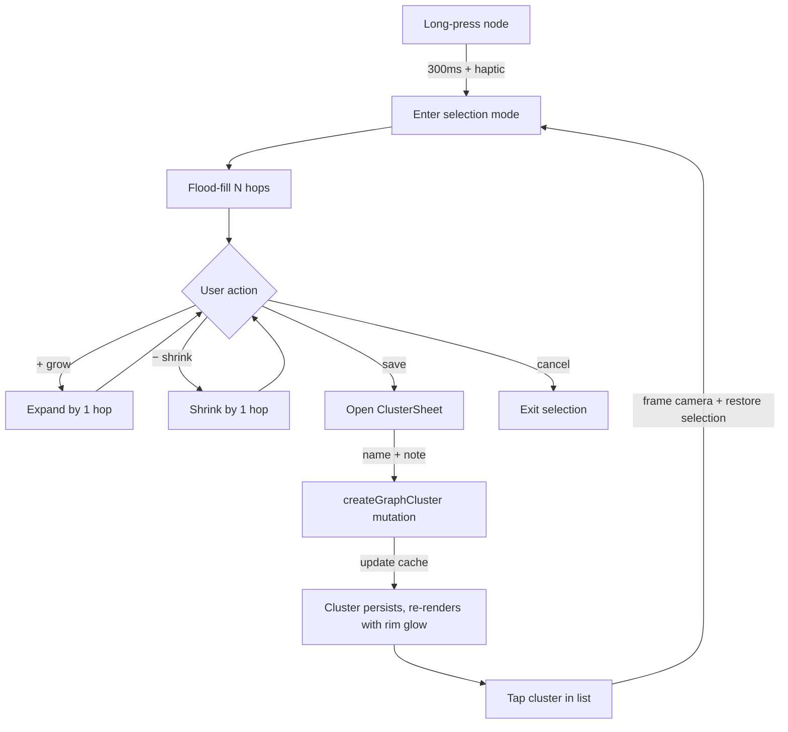

# Design: 3D Clusters and Annotations

## Context

The 3D graph (`web/src/components/ThreeGraphRenderer/ThreeGraphRenderer.tsx`) is shipped and visually read-only. This document designs the minimum additions that make it editable: clusters (persistent named subgraphs) and annotations (text anchored to a node or cluster, rendered in space).



## Goals

1. **One input, one outcome.** Long-press is the entire selection gesture. No mode toggle, no multi-tap combos, no secondary toolbar.
2. **Mobile-first by construction.** Every code path is exercised by touch first. Mouse/keyboard support is a strict subset — it piggybacks on the same state machine.
3. **Zero perf regression.** Selection + annotation rendering must not drop the 60 fps target on the 3D backend. That means GPU-friendly encoding of selection state and pre-baked textures for annotation text.
4. **Accessible from day one.** Every interaction has a keyboard equivalent, selection state is `aria-live`, focus is managed.
5. **Data is simple and owned.** Postgres rows with strict user scoping. No collaboration, no sharing, no realtime — those are later.

## Non-Goals

- Automatic cluster detection — a future change.
- Freeform drawing / shapes / arrows in 3D — annotations are text only.
- Sharing clusters across users — collaboration is a separate workstream.
- Cluster hierarchies (clusters of clusters) — flat model for now.

## Decisions

### D1. Selection state lives in `GraphClient`, not the renderer

**Decision:** `GraphClient` owns `selectedClusterNodeIds: Set<string>` and `clusterSelectionAnchorId: string | null`. `ThreeGraphRenderer` receives selection as a prop.

**Why:** The same selection model is usable from the 2D Canvas and WebGL backends later. Putting it in the renderer would hard-couple it to Three. Putting it in `GraphClient` also lets the keyboard/list-view paths drive the same state without needing a Three scene to exist.

**Alternative considered:** Selection inside the renderer with events bubbling up. Rejected because it forces every backend to reimplement the same logic.

### D2. Selection growth via BFS bounded by hop count

**Decision:** Flood-fill is a bounded BFS from the anchor node, using the `neighborIndex` adjacency map already computed in `GraphClient` (`neighborIndex.idx`). Default is 2 hops. `+ grow` adds 1 to the hop bound; `− shrink` subtracts 1. Minimum 0 (just the anchor); maximum 5 (prevents runaway on dense graphs).

**Why:** The adjacency index is already in memory and recomputed cheaply. BFS with a hop bound is the obvious mental model: "cards connected to this one, within 2 steps." It gives a predictable, visual-first result — users can *see* the selection grow.

**Alternative considered:** Connected components (flood until exhausted). Rejected because most BYOA graphs have one giant component, so a flood would select everything.

**Alternative considered:** Distance-based via d3 layout positions. Rejected because it picks up visually-close cards that aren't actually topologically related — confusing.

### D3. Selection state pushed to GPU via a per-vertex attribute, not a uniform array

**Decision:** The Three.js `BufferGeometry` already has an `aIndex` attribute for colors. Add a parallel `aSelected` attribute (Float32, 0 or 1) that the fragment shader samples. The shader brightens the rim glow when `aSelected > 0.5`.

```glsl
// In NODE_FRAG (new):
uniform float uSelected; // unused, replaced by varying
varying float vSelected;
// ...
float selectedBoost = vSelected * 0.6;
vec3 col = mix(vColor, vec3(1.0), (rim * 0.4) + selectedBoost);
float outerGlow = smoothstep(0.5, 0.6, d) * vSelected * 0.3;
gl_FragColor = vec4(col + outerGlow, circle + outerGlow);
```

**Why:** Selection can contain hundreds of nodes. A uniform array of selected IDs would force the shader to loop per-fragment. A per-vertex attribute is GPU-native: update a Float32Array once per selection change, mark the buffer `needsUpdate = true`, done.

**Alternative considered:** Render a second pass with only the selected nodes. Rejected because it doubles draw calls and halves the 60 fps headroom we bought with the single-draw-call design.

### D4. Annotations are billboards with pre-baked canvas textures

**Decision:** Each `GraphAnnotation` becomes a `THREE.Sprite` (camera-facing quad). The sprite's texture is pre-rendered on a 2D `OffscreenCanvas` (or `HTMLCanvasElement` fallback) with the annotation text, border, and background. The texture is uploaded to GPU once, then the sprite just translates/scales per frame.

**Why:** Rendering text in WebGL from scratch is expensive (SDF fonts, shader logic). Pre-baking to canvas gives us:
- Real browser text shaping + emoji + accents for free.
- One texture upload per annotation, zero per-frame cost after that.
- Easy theming (use `var(--surface-floating)` / `var(--foreground)` computed styles at bake time).
- Perfect sharpness on retina displays (bake at `devicePixelRatio * 2`).

**Alternative considered:** `troika-three-text` or similar SDF text libraries. Rejected — adds a ~50 kB dep and we only need short, infrequent text labels.

**Alternative considered:** HTML/DOM overlays positioned in screen space via `camera.project()`. Rejected because they don't compose with the 3D depth/tilt — annotations would always feel "on top" instead of "in space."

### D5. Long-press threshold is 300 ms with a 10 px movement tolerance

**Decision:** A pointer held for ≥ 300 ms within a 10 px movement window fires `onLongPress(nodeId)`. On mobile, vibrate via `haptic('medium')` at the threshold to signal success before the user lifts.

**Why:** 300 ms is the iOS/Material standard. Shorter feels accidental; longer feels broken. The 10 px tolerance prevents a jittery finger from cancelling. The haptic is a promise: "I heard you, keep holding if you want to continue, lift now to cancel." Users can trust and cancel gestures without penalty.

**Alternative considered:** 500 ms (Android long-press default). Rejected because the Haptics API + the bottom-right tilt handle already trained users to expect snappy response; 500 ms will feel sluggish by comparison.

### D6. Data model: one `GraphCluster` row per cluster, one `GraphAnnotation` row per annotation

**Decision:**

```prisma
model GraphCluster {
  id        String   @id @default(cuid())
  userId    String
  spaceId   String?
  name      String
  note      String?  // up to 280 chars
  nodeIds   String[] // card IDs — validated against Card table on write
  createdAt DateTime @default(now())
  updatedAt DateTime @updatedAt

  user User @relation(fields: [userId], references: [id], onDelete: Cascade)

  @@index([userId, createdAt])
  @@index([userId, spaceId])
}

model GraphAnnotation {
  id         String   @id @default(cuid())
  userId     String
  anchorType String   // 'node' | 'cluster'
  anchorId   String   // card ID or cluster ID
  text       String   // up to 280 chars
  offsetX    Float?   // optional position offset from anchor, 3D
  offsetY    Float?
  offsetZ    Float?
  createdAt  DateTime @default(now())
  updatedAt  DateTime @updatedAt

  user User @relation(fields: [userId], references: [id], onDelete: Cascade)

  @@index([userId, anchorType, anchorId])
  @@index([userId, createdAt])
}
```

**Why:**
- `nodeIds` as a Postgres `String[]` column. Small lists (typically 10–200 IDs). Avoids a join table and keeps cluster loads to one row. We lose per-node FK integrity, which is accepted — server-side validation on write catches unknown IDs, and cluster reads tolerate missing IDs gracefully (the 3D renderer skips IDs that aren't in the current graph).
- `anchorType + anchorId` is a polymorphic reference. Not ideal for FK integrity but practical — annotations anchor to either a card or a cluster, and enforcing that at the DB layer would require two columns + a check constraint. The service layer validates.

**Alternative considered:** A join table `GraphClusterNode(clusterId, nodeId)`. Rejected because it's more queries and more complexity for a list that's bounded by screen real estate anyway.

### D7. Apollo cache updates mirror the archive/delete pattern

**Decision:** On `createGraphCluster` success, `cache.modify` the root `graphClusters` field to prepend the new cluster. On `deleteGraphCluster`, filter out by ID. On update, rely on Apollo's normalized entity update (GraphCluster has an `id`, so it's normalized automatically). Same pattern as the archive/delete fix we just landed in `864e718`.

**Why:** Consistent with the rest of the codebase and avoids refetches that would re-settle the 3D simulation.

## Interaction Model

### Mobile (primary)

| Gesture | Action |
|---|---|
| Tap node | Focus (existing behavior) |
| Long-press node (300 ms) | Enter selection mode, flood-fill 2 hops, haptic `medium` |
| Tap additional node in selection | Add to selection, haptic `light` |
| Long-press selected node | Remove from selection, haptic `selection` |
| Pinch | Camera zoom (existing tilt handle behavior preserved) |
| Drag tilt handle | Rotate ortho→perspective (existing) |
| Tap "save cluster" FAB | Open `ClusterSheet` bottom sheet |
| Tap "annotate" in cluster sheet | Open `AnnotationComposer` |
| Swipe down on ClusterSheet | Dismiss, keep selection |
| Tap outside selection | Exit selection mode, haptic `selection` |

### Desktop

| Input | Action |
|---|---|
| Click node | Focus |
| Shift+click node | Toggle in selection |
| Right-click node | Context menu: "Select connected (2 hops)", "Annotate…" |
| Cmd/Ctrl+A (while focused) | Select all visible |
| `/` | Focus node search |
| `Space` (while a node is focused) | Toggle in selection |
| `Enter` (with non-empty selection) | Open ClusterSheet |
| `Esc` | Exit selection |

### Keyboard flow for accessibility

1. User tabs into the graph → `aria-label="Graph. Use arrow keys to traverse nodes, Space to select, Enter to save cluster."`
2. Arrow keys move focus between topologically-connected nodes.
3. Focused node gets a 2 px outline (rendered via the same `aSelected` attribute with a distinct shader branch).
4. `Space` toggles the current node in the cluster selection.
5. `Enter` with a non-empty selection opens the ClusterSheet.
6. All state transitions announced via `aria-live="polite"`: e.g. "3 cards selected", "Cluster 'Tadao Ando' saved."

## Risks

| Risk | Mitigation |
|---|---|
| **Long-press vs. scroll conflict on mobile.** The 3D canvas already captures `touchAction: 'none'` when graph mode is active, so page scroll isn't at risk. But a long-press that triggers accidentally during a pan gesture would be annoying. | The long-press state machine cancels on any pointer movement > 10 px. Pan is unaffected because it moves beyond that threshold immediately. |
| **Selection visual reads as focus.** If selection uses the same rim glow as focus, users can't tell them apart. | Selection uses an extra outer glow + slight color shift. Focus keeps its existing brighter-rim treatment. Both visualized in spec-review before shipping. |
| **Annotation text overlap at low zoom.** Many annotations in a small area become a mess. | Annotation billboards fade out below a minimum projected size (~8 px), then fade back in on zoom. This is a cheap per-frame distance check, no layout cost. |
| **User saves a cluster with no name.** | `name` is required in the SDL and validated client-side. The save button is disabled until a non-empty name is entered. |
| **Annotation anchored to a deleted card.** | On `deleteCard`, we already evict from `graphData` — extend the same service hook to delete orphaned annotations where `anchorType = 'node'`. Cluster annotations survive because clusters persist independently. |
| **3D performance regression.** | Benchmark: 500 nodes, 3 clusters each with ~100 nodes, 50 annotations. Must hold 60 fps on a 2020 iPhone SE. Add a Playwright performance test gating the merge. |
| **Touch target too small for the radial menu.** | Each radial item is 56 px (min 44 px accessibility spec + comfort margin). Radial radius 90 px from the anchor. Tested on iPhone SE viewport. |

## Migration

- No existing data to migrate — this is additive.
- Two new Prisma migrations: `add_graph_clusters`, `add_graph_annotations`.
- No rollout staging; the feature ships dark (no UI) until the code is proven, then a feature flag enables the long-press affordance.

## Open Questions

1. **Should clusters be spaceable?** Currently `spaceId` is nullable on `GraphCluster`. Do we auto-include a cluster when filtering by its space? **Decision:** yes, if cluster has `spaceId`, it appears when that space is active. Cross-space cluster = `spaceId = null`.
2. **Should annotations appear in the 2D graph and list view too, or only 3D?** **Decision:** all graph views. The billboard logic is Three-specific, but the 2D canvas path renders them as small floating labels near the node, and list view shows them under the card title. This makes them worth the effort to create.
3. **Do we need a "cluster center of mass" for camera framing?** **Decision:** yes, compute `mean(x, y, z)` of all selected nodes and `fg.centerAt` + `fg.zoom` to frame the cluster. Simple and reliable.
