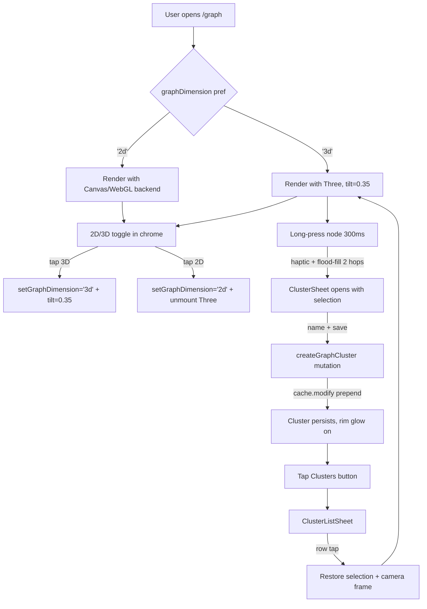

# Design: Fix 3D Graph and Complete Cluster Flow

## Context

The prior change `3d-clusters-and-annotations` built the data layer (Prisma models, SDL, services), the selection state machine (`useClusterSelection.ts`, `floodFillFromAnchor`), and the UI shell (`ClusterSheet.tsx`). It stopped short of the things that make the feature usable: the 3D canvas renders nothing, the pointer events never fire, the save button is wired to `undefined`, and the migration was never deployed. The user reported: *"I couldn't really see 2D and 3D difference. I thought there will be a toggle."*

This document scopes the narrowest fix that turns the existing shell into an end-to-end flow.



## Goals

1. **Visible 3D on tap one.** Selecting `3D` from the toggle produces an immediately visible depth effect — users see nodes stratified along the z-axis with parallax motion, not a flat-looking rendering with a "3D" label.
2. **Single source of truth for dimensionality.** `graphDimension` lives in `UserPreferences` and is the only place that decides which renderer is mounted. The advanced picker chooses the *2D technology* independently.
3. **End-to-end cluster save in ≤ 3 taps.** Long-press → name → save. No hidden steps, no failed mutations, no 500s from a missing table.
4. **Zero regression on Canvas / WebGL backends.** Canvas stays the default-default. WebGL keeps its existing perf wins. The fix touches them only to thread `neighborSetsByNode` and to accept the new (optional, ignored) long-press callbacks.
5. **Do the minimum.** Every additional feature from the prior change's Groups 7–10 (annotations, a11y, perf gates, feature flag) is deferred.

## Non-Goals

- Annotations. Tables exist, UI does not. Separate change.
- Keyboard-only cluster creation. The prior change's Group 8 owns that.
- Performance benchmarks. The prior change's Group 9 owns that.
- `User` / `Card` foreign keys on `GraphCluster`. There is no `User` model; Card has no FK either. Changing that is a schema-wide decision.
- iA Writer font loading. Orthogonal typography change.

## Decisions

### D1. Dimensionality is a separate axis from technology

**Decision:** Add `UserPreferences.graphDimension: '2d' | '3d'` (default `'2d'`). Keep `graphRenderer: 'canvas' | 'webgl' | 'three'` as-is but reinterpret its role. The effective renderer at render time is:

```ts
const effectiveRenderer = graphDimension === '3d'
  ? 'three'
  : (graphRenderer === 'three' ? 'canvas' : graphRenderer)
```

**Why:** Users think in dimensions ("I want the flat view" / "I want the depthy one"), not in rendering libraries. Surfacing "Canvas vs WebGL vs Three.js" as the primary choice is a category error. But we can't collapse the picker either — the 2D technology choice is a legitimate power-user setting (Canvas is more compatible, WebGL is faster on dense graphs). So we add a new primary axis and demote the existing picker to "2D backend".

**Alternative considered:** Remove `graphRenderer` entirely and let `graphDimension` map directly to one renderer each (`2d` → canvas, `3d` → three). Rejected because it deletes the WebGL work we already shipped and reduces user control.

**Alternative considered:** Collapse to one column and use `'2d-canvas' | '2d-webgl' | '3d'`. Rejected because it makes the toggle implementation branchier — flipping 2D↔3D would need to remember the last 2D backend anyway.

### D2. Three camera — ortho at flat, perspective at tilt, interpolated by `tiltRef.current`

**Decision:** Replace the single `PerspectiveCamera(fov=1°)` with two cameras, both pointing at `(width/2, height/2, 0)`:

```ts
const orthoCam = new THREE.OrthographicCamera(
  -width / 2, width / 2,
   height / 2, -height / 2,
  -2000, 2000,
)
orthoCam.position.set(width / 2, height / 2, 600)
orthoCam.lookAt(width / 2, height / 2, 0)

const perspCam = new THREE.PerspectiveCamera(45, width / height, 0.1, 10000)
// Distance chosen so the ortho frustum and perspective frustum match at z=0:
// distance = (height / 2) / tan(fov/2) = (height / 2) / tan(22.5°)
const dist = (height / 2) / Math.tan((45 * Math.PI / 180) / 2)
perspCam.position.set(width / 2, height / 2, dist)
perspCam.lookAt(width / 2, height / 2, 0)

// Per frame:
const activeCam = tiltRef.current < 0.05 ? orthoCam : perspCam
// Tilt 0..1 animates perspCam.rotation.x from 0 to -π/4 around the target
perspCam.position.x = width / 2
perspCam.position.y = height / 2 + Math.sin(tiltRef.current * Math.PI / 4) * dist
perspCam.position.z = Math.cos(tiltRef.current * Math.PI / 4) * dist
perspCam.lookAt(width / 2, height / 2, 0)
```

**Why:**
- The previous design used FOV morph (1° → 60°) to fake ortho, but at fov=1° the visible window (`2·d·tan(0.5°)`) is ~10 world units, orders of magnitude smaller than the simulation's ~800-unit spread. This is the root cause of the blank canvas.
- A true `OrthographicCamera` at tilt 0 renders every node regardless of depth — guarantees we never lose the graph to frustum clipping.
- A `PerspectiveCamera` at tilt ≥ 0.05 provides real depth cues (nodes on lower-z planes appear smaller / further).
- Orbital motion around `(width/2, height/2, 0)` is what gives the tilt affordance its "rotate the scene" feel.
- Switching cameras is free (one reference swap per frame); no shader changes.

**Alternative considered:** Single perspective camera with aggressive fov (fov=60°) from tilt 0. Rejected because at fov=60° nodes at the edges of the simulation look compressed (fish-eye), and the design intent per §D2 of the prior change is "flat feel at rest, tilt on demand."

**Alternative considered:** Scale the simulation down 100× to match the 10-unit frustum. Rejected because it breaks edge length tuning and interferes with the shared d3 state between backends.

### D3. Default tilt = 0.35 when dimension is `3d`

**Decision:** When `graphDimension === '3d'`, `ThreeGraphRenderer` initializes `tiltRef.current = 0.35`, not 0. The tilt handle still lets the user drag to 0 (flat) or 1 (full).

**Why:** The prior design's "flat by default, tilt on demand" intent is fine for a dedicated 3D page, but not for a toggle that switches dimensionality. A user who taps `3D` and sees a flat-looking graph will conclude the toggle is broken. Starting at ~35% tilt shows immediate depth without overwhelming new users.

**Alternative considered:** Default tilt=0 with an animated tilt-in on first 3D mount. Rejected because animation masks the "is this actually 3D?" question for 500 ms of confusion.

### D4. Three pointer wiring — a single `Raycaster` + bounded long-press state machine

**Decision:** Add to `ThreeGraphRenderer` init:

```ts
const raycaster = new THREE.Raycaster()
raycaster.params.Points = { threshold: 12 }  // 12 px screen-space

const pointer = new THREE.Vector2()

const longPressState: {
  pointerId: number | null
  startMs: number
  startX: number
  startY: number
  nodeId: string | null
  timer: number | null
} = { pointerId: null, startMs: 0, startX: 0, startY: 0, nodeId: null, timer: null }

function pickNodeAtPointer(clientX: number, clientY: number): string | null {
  const rect = canvas.getBoundingClientRect()
  pointer.x =  ((clientX - rect.left) / rect.width)  * 2 - 1
  pointer.y = -((clientY - rect.top)  / rect.height) * 2 + 1
  raycaster.setFromCamera(pointer, activeCam)
  const hits = raycaster.intersectObject(pointCloud, false)
  if (hits.length === 0) return null
  const idx = (hits[0] as { index?: number }).index ?? -1
  return idx >= 0 ? simNodes[idx]?.id ?? null : null
}
```

- `pointermove` → throttled (RAF-guarded) pick → `onHoverRef.current(nodeId | null)`
- `pointerdown` → record start, start 300 ms timer
- `pointermove` during press → if distance > 10 px, cancel timer + clear long-press state
- `pointerup` within 8 px & < 250 ms → tap: `onClickRef.current(nodeId)`
- timer fires → long-press: `haptic('medium')`, `onLongPressNode(nodeId)`

**Why:** One raycaster, one state machine, no extra libraries. Matches the prior change §D5 (300 ms threshold, 10 px tolerance, haptic on fire). Canvas and WebGL backends can adopt the same state machine later but are unaffected for now.

**Alternative considered:** CPU hit-test by projecting simulation node positions to screen space. Rejected because it duplicates work the raycaster already does and doesn't handle the ortho-to-perspective camera swap.

**Alternative considered:** Use `react-use-gesture` for the long-press. Rejected — the logic is ~30 LOC, the dependency is 40 kB.

### D5. Cluster save uses the archive/delete cache pattern

**Decision:** `createGraphCluster` mutation in `GraphClient.tsx` uses `cache.modify` to prepend to the root `graphClusters` field:

```ts
const [createCluster] = useMutation(CREATE_GRAPH_CLUSTER, {
  update(cache, { data }) {
    const created = data?.createGraphCluster
    if (!created) return
    cache.modify({
      fields: {
        graphClusters(existing = [], { readField }) {
          const newRef = cache.writeFragment({
            data: created,
            fragment: GRAPH_CLUSTER_FRAGMENT,
          })
          if (existing.some((r: { __ref: string }) =>
            readField('id', r) === created.id
          )) return existing
          return [newRef, ...existing]
        },
      },
    })
  },
})
```

`deleteGraphCluster` filters the same field by id. This is the exact pattern used by `archiveCard` / `deleteCard` in commit `864e718` — importing that precedent prevents re-introducing the simulation-resettle bug that refetches caused.

**Why:** Apollo's default "merge on return" behavior works, but for the 3D view any refetch of `graphCards` or `graphLinks` triggers a fresh d3-force simulation, which scrambles positions. We avoid that by never invalidating graph data — only the clusters field.

### D6. `ClusterListSheet` composes the existing sheet primitives

**Decision:** `ClusterListSheet.tsx` reuses the `Sheet` component used by `ClusterSheet` (same bottom-sheet-on-mobile / slide-over-on-desktop split). Rows are simple: name (prominent), note preview (muted, 1 line), node count pill, relative timestamp. Row tap restores selection + triggers camera frame. Row long-press opens a `ConfirmDialog` (existing primitive) and runs `deleteGraphCluster` on confirm.

**Why:** The prior change's Group 6 was spec'd as a new sheet but no implementation exists. Reusing primitives keeps this to ~130 LOC and matches existing visual language.

### D7. Camera framing — orbital distance from cluster bounding sphere

**Decision:** Expose `frameTo(target: Vector3, radius: number)` as an imperative method on `ThreeGraphRenderer` (via `forwardRef`). Implementation:

```ts
frameTo(target: Vector3, radius: number) {
  const padding = 1.4
  const dist = (radius * padding) / Math.tan((45 * Math.PI / 180) / 2)
  // Animate perspCam.position to {target.x, target.y + sin(tilt)*dist, cos(tilt)*dist}
  // Animate over 600 ms with ease-out cubic
}
```

Bounding sphere computed from the selected cluster's current simulation positions: `center = mean(positions)`, `radius = max(distance(p, center))`.

**Why:** A simple bounding sphere is adequate for cluster framing — the user wants "see this group in context" not cinematic framing. 600 ms matches the existing tilt-handle animation timing.

### D8. `neighborSetsByNode` as the neighbor index for WebGL focus dimming

**Decision:** `GraphClient` derives a `Map<string, Set<string>>` from the existing `neighborIndex.idx`:

```ts
const neighborSetsByNode = useMemo(() => {
  const m = new Map<string, Set<string>>()
  for (const [nodeId, neighborIds] of Object.entries(neighborIndex.idx)) {
    m.set(nodeId, new Set(neighborIds))
  }
  return m
}, [neighborIndex])
```

Thread through to `WebGLGraphRenderer` as a prop. Inside `WebGLGraphRenderer.tsx:201`:

```ts
const isNeighbor = focusedNodeId
  ? neighborSetsByNode.get(focusedNodeId)?.has(node.id) ?? false
  : false
```

**Why:** Cheap derivation (O(V+E) once per data change), zero new compute during rendering, fixes the "focus dims neighbors" bug cleanly. Canvas backend already uses its own neighbor lookup so it's unchanged.

### D9. UUID validation — drop the `uuid` package, use regex

**Decision:** Delete `import { validate as validateUuid } from 'uuid'` from `graphClusters.ts:4` and `graphAnnotations.ts:4`. Replace with a module-local `isUuid` helper:

```ts
const UUID_RE = /^[0-9a-f]{8}-[0-9a-f]{4}-[0-9a-f]{4}-[0-9a-f]{4}-[0-9a-f]{12}$/i
const isUuid = (s: string) => UUID_RE.test(s)
```

**Why:** The `uuid` package export layout conflicts with `nodenext` module resolution in the Redwood API side. The validation requirement is narrow — 36 chars, hex + dashes. A regex is three lines, has zero dependencies, and can't break under type refresh. The runtime proved the current code path works (invalid uuids are correctly rejected in prod); we just need to stop the type-check error.

**Alternative considered:** Add `"moduleResolution": "node"` override for the two files. Rejected because it weakens the project's type hygiene and can cascade.

### D10. Test seeding — share a fixture helper between specs

**Decision:** Add a `seedGraphCards(page, count=8)` helper in `e2e/fixtures.ts` that calls the existing `createCard` fixture N times across 4 types. Import into `graph-renderer-picker.spec.ts` `beforeEach`. Also export for future graph specs.

**Why:** The 4 failing Playwright specs all short-circuit to `<Empty />` at `GraphCell.tsx:77`. Seeding happens once per spec file, takes ~2s, unblocks all 4 specs without refactoring the specs themselves. Exporting the helper prevents the same bug from recurring when new graph specs are added.

## Data Model Changes

### `UserPreferences` — new column

```prisma
model UserPreferences {
  userId         String   @id @map("user_id")
  graphRenderer  String   @default("canvas") @map("graph_renderer")
  graphDimension String   @default("2d")     @map("graph_dimension")   // NEW: '2d' | '3d'
  updatedAt      DateTime @default(now()) @updatedAt @map("updated_at") @db.Timestamptz

  @@map("user_preferences")
}
```

Migration: `ALTER TABLE user_preferences ADD COLUMN graph_dimension VARCHAR(2) DEFAULT '2d' NOT NULL`. Backfill defaults to `'2d'` for every existing row (all users currently see a 2D view, nothing changes for them).

### Prior (unapplied) migration stays as-is

`api/db/migrations/20260413055733_add_graph_clusters_and_annotations/` is correct structurally; it was just never `deploy`ed. We run it as step 0 of this change.

## Interaction Model

### Dimensionality toggle

| Gesture | Action |
|---|---|
| Tap `2D` while on 3D | `setGraphDimension('2d')`, unmount Three, mount last-selected 2D backend (`canvas` or `webgl`), fade over 200 ms |
| Tap `3D` while on 2D | `setGraphDimension('3d')`, mount Three, initialize `tiltRef.current = 0.35`, fade over 200 ms |
| Toggle is disabled during 3D → 2D transition to prevent double-mounts |

### 3D renderer pointer gestures

| Gesture | Action |
|---|---|
| Hover node | Rim glow brightens, `onHoverRef.current(nodeId)` fires, tooltip appears at screen-space pointer |
| Tap node (< 250 ms, < 8 px) | Focus: `onClickRef.current(nodeId)`, existing focus mode engages |
| Long-press node (≥ 300 ms, < 10 px movement) | `haptic('medium')`, `onLongPressNode(nodeId)` fires, `floodFillFromAnchor(nodeId, 2)` seeds selection, `ClusterSheet` opens |
| Drag tilt handle | Existing orbital rotate (preserved) |
| Tap tilt handle | Snap back to `tiltRef.current = 0.35` (was `0` — now matches 3D default) |

### Cluster save flow

1. Long-press node → selection seeded, sheet opens with empty name field focused.
2. Type name (required, 60 chars). Note (optional, 280 chars).
3. Tap Save → `createGraphCluster` → on success: sheet dismisses, selection clears, toast "Cluster saved." On failure: sheet stays, inline error, selection preserved.
4. Esc / swipe down dismisses sheet and preserves selection.

### Cluster restore flow

1. Tap "Clusters" button in graph chrome → `ClusterListSheet` opens.
2. Tap a cluster row → sheet closes, selection restored to `cluster.nodeIds`, camera frames the cluster's bounding sphere over 600 ms. If current dimension is `2d`, restore works but no camera frame (2D renderers don't expose `frameTo`).
3. Long-press row → confirm delete dialog → `deleteGraphCluster` → cache filter by id.

## Risks

| Risk | Mitigation |
|---|---|
| **The migration runs successfully in local dev but fails on Supabase** (e.g. existing table with conflicting name, RLS preventing DDL). | Step 0.1 of tasks runs the migration as a dry-run via `prisma migrate diff`, checks for conflicts, then applies. If apply fails, surface the exact Postgres error and abort. |
| **Three pointer events conflict with the tilt handle pointer capture.** | The tilt handle uses `setPointerCapture` inside its own pointer handlers (line 289). Canvas pointer events are attached to the canvas, not the handle. `pointer-events: none` on the handle's hit area when not being dragged. Tested manually via Chrome DevTools MCP. |
| **2D ↔ 3D toggle re-mounts the renderer and resets the simulation**, losing user focus / scroll position. | Keep the simulation state in `GraphClient` via `useRef`, not `useState`. On remount, the new renderer receives the already-converged `simNodes` positions via props. Nodes appear where they were. |
| **The `Raycaster` threshold of 12 px is off for high-DPI displays** — nodes are harder to hit on retina. | `raycaster.params.Points = { threshold }` is in world units for ortho and screen pixels scaled by distance for perspective. At our default distance we compute `threshold = 12 * worldUnitsPerPixel` on resize. |
| **Cluster save mutation succeeds but cache.modify fails silently**, leaving the cluster invisible until refresh. | Integration test: create a cluster, assert the cluster appears in `ClusterListSheet` without a page reload. Playwright spec with network mocking. |
| **`pointermove` long-press cancellation throws during tilt drag** — if the tilt handle swallows the `pointermove`, the canvas state machine never gets the cancel signal. | Attach `pointermove` to `window` during an active long-press press, not just the canvas. `pointermove` cancels regardless of where the pointer is. |
| **Default tilt of 0.35 makes the flat-rest design intent harder to find.** | Preserved tilt handle tap-snap (single tap) still snaps to `0.35` not `0`. Users who want flat drag to `0`. Doc tooltip on the handle explains the difference. |

## Migration

1. Apply the prior `add_graph_clusters_and_annotations` migration to Supabase via `yarn rw prisma migrate deploy`. Verify with `SELECT 1 FROM graph_clusters LIMIT 0`.
2. Apply the new `add_graph_dimension_to_user_preferences` migration. Backfill defaults to `'2d'`.
3. Deploy web + api code.
4. Existing users land on 2D (their current view). No UI change unless they tap `3D`. First tap on `3D` triggers the OrthographicCamera + PerspectiveCamera mount, tilt=0.35, flood-fill-ready state.

## Open Questions

1. **Should `3D` tilt default decay toward 0 after N seconds of no interaction?** — An argument can be made that flat-at-rest is the long-term design intent, so tilt should drift back to 0 for users who leave the page open. **Decision:** no drift in this change. Tilt is user-controlled. Drift can be layered later if telemetry shows users leaving the page tilted by mistake.
2. **Should the `2D | 3D` toggle be a segmented control or a single icon button that flips state?** — Segmented controls are more discoverable (users see both options at once); icon buttons are more compact. **Decision:** segmented control. Discoverability wins on first use, which is what the user reported struggling with.
3. **Should the `Clusters` button in the graph chrome be visible in both 2D and 3D?** — Clusters can be selected via keyboard + long-press, both are 3D-only today. In 2D, you could still view saved clusters as highlighted nodes but can't create new ones. **Decision:** visible in both. Restore works in 2D (just no camera frame); create is 3D-only until Group 4 of the prior change lands for Canvas/WebGL.
